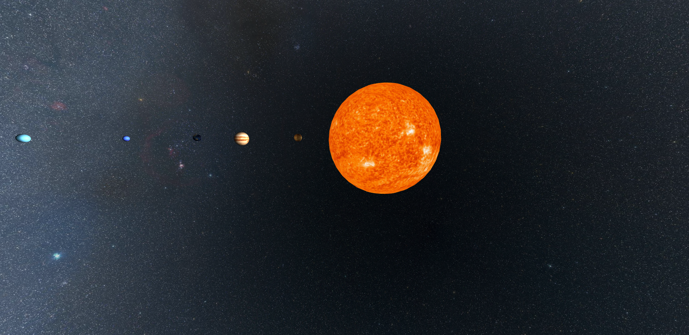
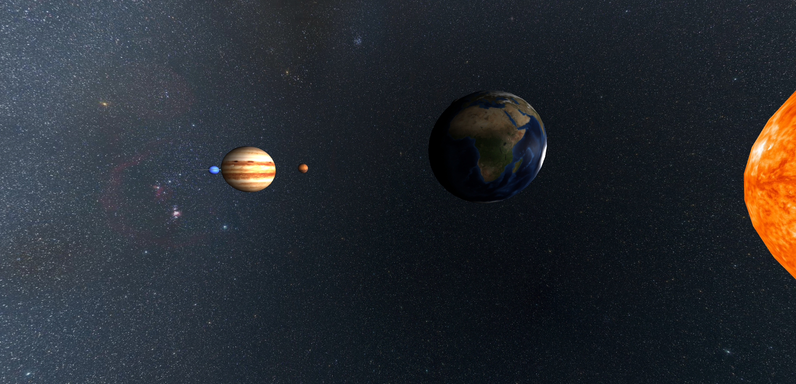
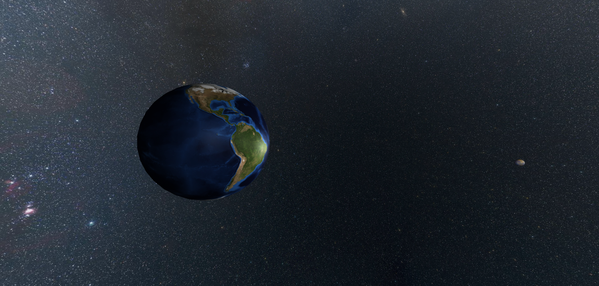

# 3D Web Solar System

A 3D interactive model of the solar system built with three.js/A-Frame.  
Features accurate rotation, scaling, lighting, and WebVR support.

## Preview

Here are some screenshots of the project:

## Features

- Realistic rotation and scaling of planets
- Interactive 3D locomotion
- Lighting and shadow effects
- WebVR compatible — VR must be enabled
- Built with A-Frame and Web technologies

## How to Run

1. Clone or download the project.
2. Serve the files using a local web server (required to run A-Frame/WebVR properly).
    - Example with Python:  
      `python -m http.server`  
      then open `http://localhost:8000/` in your browser.
    - Or use extensions like **Live Server** in Visual Studio Code.
